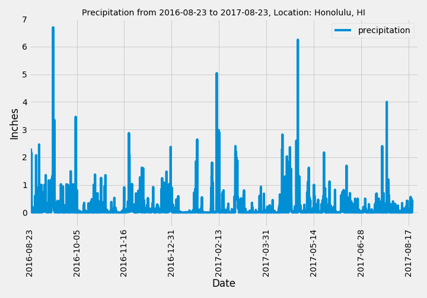
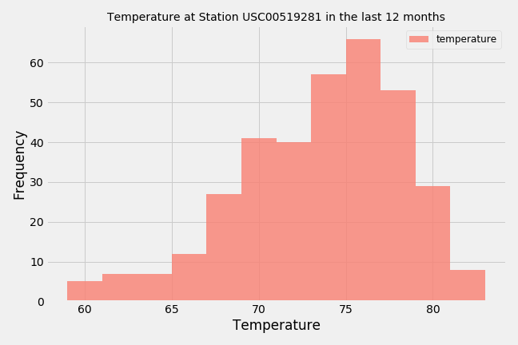

# SQLAlchemy Homework - Surfs Up!
## Climate Analysis and Exploration
SQLAlchemy and Python were used to conduct analysis of climate in this assignment. A database file `hawaii.sqlite` was connected to a jupyter notebook in order to explore tables in the database. In the notebook the connection was created using `create_engine` and `automap_base` was used to reflect tables into classes. Then data was saved into dataframes for further analysis. The precipitation and station analysis was conducted in this [climate_analysis.ipynb](https://github.com/KeSavanh/sqlalchemy-challenge/blob/main/climate_analysis.ipynb).
## Precipition Analysis

* Retrieve the last 12 months of precipitation data by querying the 12 preceding months of data. 

* Select only the `date` and `prcp` values.

* Load the query results into a Pandas DataFrame and set the index to the date column.

* Sort the DataFrame values by `date`.

* Plot the results using the DataFrame `plot` method.

* Use Pandas to print the summary statistics for the precipitation data.
* Result:

## Station Analysis

* Design a query to calculate the total number of stations in the dataset.

* Design a query to find the most active stations.

  * List the stations and observation counts in descending order.

  * Which station id has the highest number of observations?

  * Using the most active station id, calculate the lowest, highest, and average temperature.

* Design a query to retrieve the last 12 months of temperature observation data (TOBS).

  * Filter by the station with the highest number of observations.

  * Query the last 12 months of temperature observation data for this station.

  * Plot the results as a histogram with `bins=12`.

* Close out the session.
* Result:

## Climate App
The climate App [(app.py)](http://127.0.0.1:5000) was created to serve APIs for each routes below:

### Routes

* `/`

  * Home page.

  * List all routes that are available.

* `/api/v1.0/precipitation`

  * Convert the query results to a dictionary using `date` as the key and `prcp` as the value.

  * Return the JSON representation of your dictionary.

* `/api/v1.0/stations`

  * Return a JSON list of stations from the dataset.

* `/api/v1.0/tobs`
  * Query the dates and temperature observations of the most active station for the last year of data.

  * Return a JSON list of temperature observations (TOBS) for the previous year.

* `/api/v1.0/<start>` and `/api/v1.0/<start>/<end>`

  * Return a JSON list of the minimum temperature, the average temperature, and the max temperature for a given start or start-end range.

  * When given the start only, calculate `TMIN`, `TAVG`, and `TMAX` for all dates greater than and equal to the start date.

  * When given the start and the end date, calculate the `TMIN`, `TAVG`, and `TMAX` for dates between the start and end date inclusive.

## Temperature Analysis I
## Temperature Analysis II

